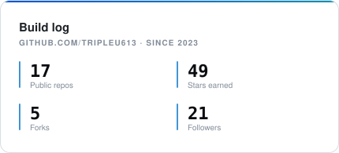
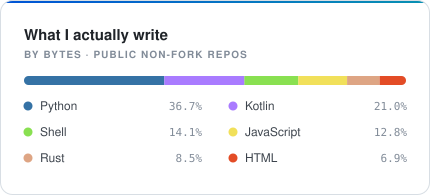
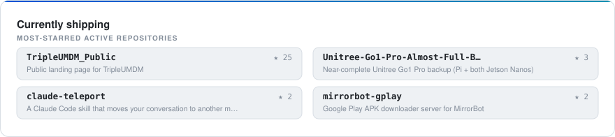

<div align="center">

# TripleU

**Software engineer · Network engineer · Kosher tech specialist**

Owner of **Jtech Forums LLC**. I build focused, private, community-powered technology —
and the networks it runs on.

<br>

[](https://tripleu.org)
[](https://forums.jtechforums.org/)
[](https://t.me/RNDSoftwareGroup)
[](https://www.linkedin.com/in/usher-weiss-882820422)
[](mailto:tripleuworld@gmail.com)

</div>

---

## whoami

Hi — I'm TripleU.

I write software, wire up the networks it lives on, and spend most of my time on
**kosher tech**: devices and services stripped down to what actually matters, without
giving up the modern essentials people genuinely need. That means custom Android
builds, MDM that gives an admin real control, filtering that holds up, and the
occasional bootloader that needed convincing.

I love building for the open source community. What I've *sold* doesn't always get to
be open — that's the trade — but everything I can put out, I do. Day job is full time
at **RND Software Group**.

If you need a hand with something, my DMs are open.

```toml
[tripleu]
roles     = ["software engineer", "network engineer", "kosher tech specialist"]
company   = "Jtech Forums LLC"          # owner
day_job   = "RND Software Group"        # full time
writes    = ["Rust", "Python", "TypeScript"]
reaches   = ["Kotlin", "Shell", "C"]    # when the hardware insists
curious   = ["machine learning", "crypto", "operating systems", "AI-assisted coding"]

[tripleu.daily_drivers]
mobile     = "Android"
desktop    = "Omarchy"
bare_metal = "Debian"
```

---

## By the numbers

<div align="center">

<picture>
  <source media="(prefers-color-scheme: dark)" srcset="assets/stats-dark.svg">
  
</picture>
<picture>
  <source media="(prefers-color-scheme: dark)" srcset="assets/languages-dark.svg">
  
</picture>

<picture>
  <source media="(prefers-color-scheme: dark)" srcset="assets/top-repos-dark.svg">
  
</picture>

</div>

<sub>These cards are rendered by [`scripts/gen_cards.py`](scripts/gen_cards.py) and committed
straight into this repo, so they're static files — no third-party widget service to go down,
hit a quota, or leave a broken image behind. A failed refresh just keeps the last good numbers.</sub>

---

## Selected work

| Project | What it is |
| --- | --- |
| [**TripleUMDM**](https://github.com/TripleU613/TripleUMDM_Public) | Mobile device management built for locked-down fleets — full admin control, real network security. [Docs](https://github.com/TripleU613/mdm-docs) · [tripleumdm.com](https://tripleumdm.com) |
| **JtechMarketplace** *(private)* | A closed, verified marketplace for tech — eBay, but vetted. Rust/Axum API behind a Next.js front end. |
| [**tormarchy**](https://github.com/TripleU613/tormarchy) | Omarchy plugin that pushes all your network traffic through Tor. |
| [**dumbcourse**](https://github.com/TripleU613/dumbcourse) | Forum UI plugin that makes Discourse usable on d-pads and ancient browsers. |
| [**LashonHoraDetector**](https://github.com/TripleU613/LashonHoraDetector) | Browser extension that filters messages on content, not keywords. |
| [**claude-teleport**](https://github.com/TripleU613/claude-teleport) | Claude Code skill that moves a live conversation to another machine. |
| [**Unitree Go1 Pro backup**](https://github.com/TripleU613/Unitree-Go1-Pro-Almost-Full-Backup-) | Near-complete sanitized image set — Pi plus both Jetson Nanos. |

Plus a pile of hardware liberation work: [Tabwee T20 bootloader unlock](https://github.com/TripleU613/Tabwee-T20-Booloader-Unlock),
[HiBy M300 partition backups](https://github.com/TripleU613/HiBy-M300-Backup),
[Linux fixes for the OneXPlayer G1](https://github.com/TripleU613/linux-onexplayer-g1).

---

## Reach me

| | |
| --- | --- |
| **Site & bio** | [tripleu.org](https://tripleu.org) |
| **Forums** | [forums.jtechforums.org](https://forums.jtechforums.org/) |
| **Telegram** | [@RNDSoftwareGroup](https://t.me/RNDSoftwareGroup) |
| **LinkedIn** | [Usher Weiss](https://www.linkedin.com/in/usher-weiss-882820422) |
| **Email** | [tripleuworld@gmail.com](mailto:tripleuworld@gmail.com) |
| **Discord** | `tripleu613` |

<div align="center">
<br>
<sub>Building things that respect the people using them.</sub>
</div>
